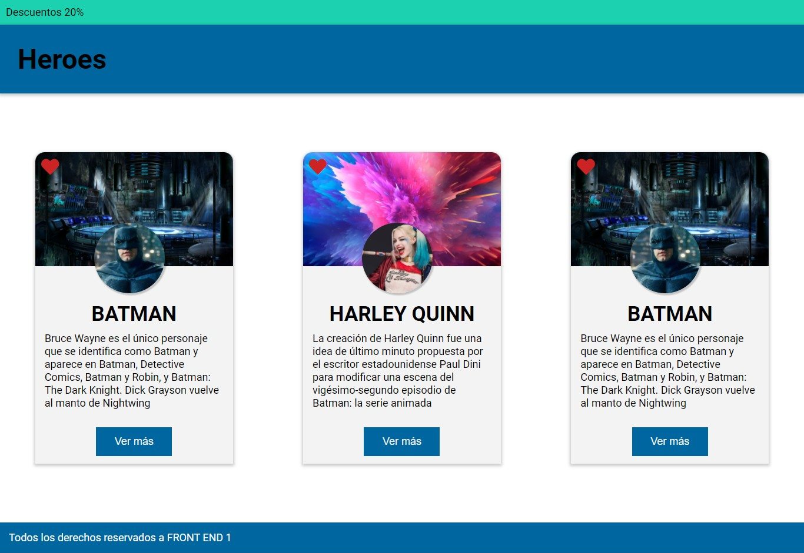

# Frontend Digital House Challenge

This is a solution to the [Class-10: Certified Tech Developer](https://www.figma.com/file/NzdP5AErhP4nblWjy9NIX5/CLASE-10). Frontend challenges help you improve your coding skills by building realistic projects. 

## Table of contents

  - [The challenge](#the-challenge)
  - [Links](#links)
  - [Built with](#built-with)
  - [Continued development](#continued-development)
  - [Useful resources](#useful-resources)

## Overview

### The challenge

Using the design developed in Figma, available at the following link, the idea will be review the different elements and styles that correspond to that visual result and layout it.
For the moment we will use the properties of the box model seen in class to be able to layout it. 
The blue bar of the Header should be fixed at the top when doing
scroll on the page.

### Screenshot

### Links

- [Live demo](https://github.com/jeraldinnemg/frontend-superhero.git)

## My process

### Built with

- Semantic HTML5 markup
- CSS custom properties

### Continued development

I'm exploring technologies so I think there are a lot of ways to get the result! I would like to try the challenge with PURE Saas or bootstrap next time.

PD: Feel free to make suggestions!

### Useful resources

- [Box model CSS](https://www.w3schools.com/css/css_boxmodel.asp) - The CSS box model is essentially a box that wraps around every HTML element. It consists of: margins, borders, padding, and the actual content.

### 

